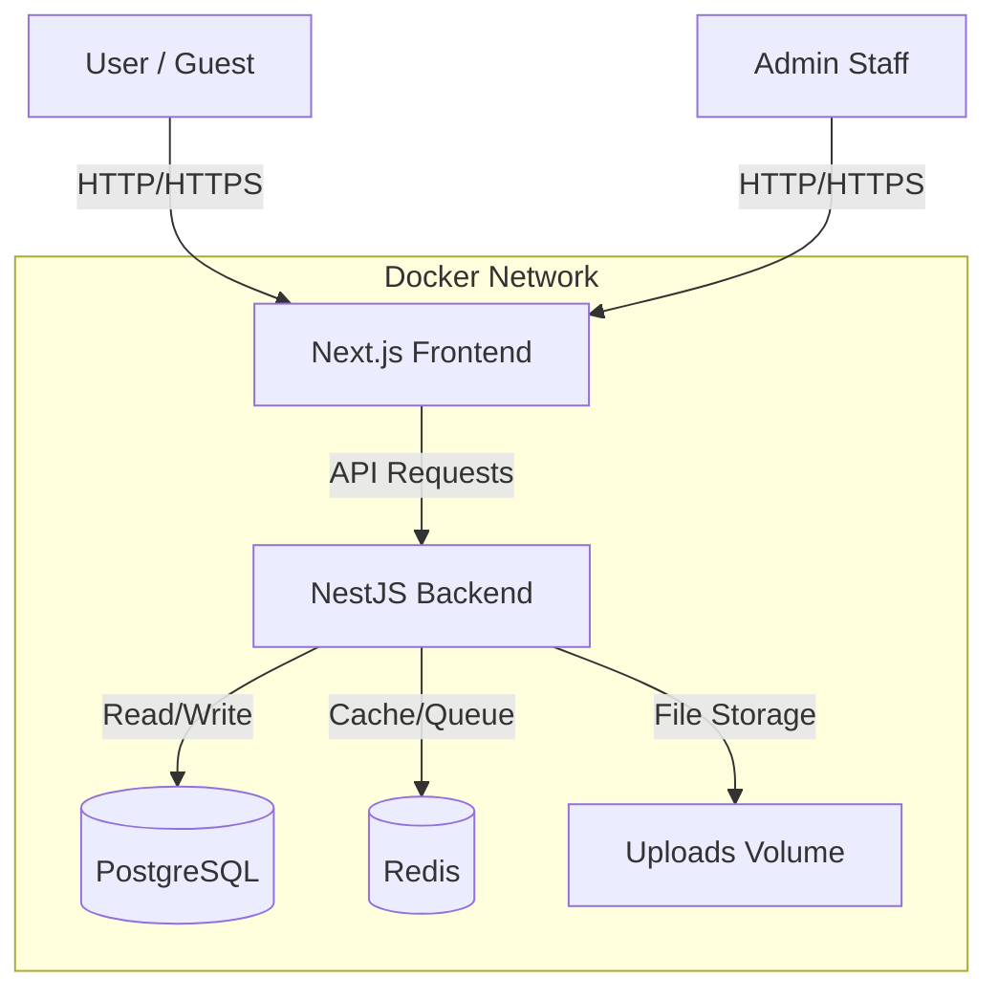

# Kimmiy Hotel - Project Overview

## 🏨 Project Description
**Kimmiy Hotel** is a modern, full-stack web application designed for hotel management and booking. It consists of a public-facing website for guests to explore rooms and services, and a comprehensive admin panel for hotel staff to manage operations.

## 🛠 Technology Stack

### Frontend
-   **Framework:** [Next.js](https://nextjs.org/) (App Router, Server Components)
-   **Language:** TypeScript
-   **Styling:** Tailwind CSS
-   **State Management:** React Context (Language), Local State
-   **HTTP Client:** Axios

### Backend
-   **Framework:** [NestJS](https://nestjs.com/)
-   **Language:** TypeScript
-   **Database ORM:** TypeORM
-   **Database:** PostgreSQL
-   **Caching/Queue:** Redis
-   **Authentication:** JWT (JSON Web Tokens) & Passport
-   **Email:** Nodemailer

### Infrastructure
-   **Containerization:** Docker & Docker Compose
-   **Reverse Proxy:** Nginx (implied for production) or Next.js Rewrites (current)

## 🏗 Architecture

## ✨ Key Features

### Public Website
1.  **Home Page:** Hero section, featured rooms, gallery.
2.  **Room Listing:** browse available rooms with details and pricing.
3.  **Services:** Information about airport transfers, spa, wifi, etc.
4.  **About Us:** Hotel history and team.
5.  **Contact:** Contact form and location map.
6.  **SEO Optimized:** Dynamic metadata for better search visibility.
7.  **Multi-language Support:** Infrastructure in place for translations (TR/EN etc).

### Admin Panel (`/admin`)
1.  **Dashboard:** Overview of bookings and stats.
2.  **Room Management:** Add, edit, remove rooms; manage availability.
3.  **Bookings:** View and manage guest reservations.
4.  **Content Management:** Update website content dynamically.
5.  **Subscribers:** Manage newsletter subscribers.
6.  **Login/Auth:** Secure JWT-based authentication.

## 📂 Project Structure

### `/frontend`
-   `src/app/(public)`: Public-facing pages (Home, About, Rooms).
-   `src/app/admin`: Admin dashboard and management pages.
-   `src/components`: Reusable UI components (Hero, Navbar, RoomCard).
-   `src/lib`: Utilities, API client configuration, translations.

### `/backend`
-   `src/auth`: Authentication logic (Login, Register, JWT).
-   `src/rooms`: Room entity and CRUD logic.
-   `src/bookings`: Reservation system logic.
-   `src/upload`: File upload handling (Local storage with Docker volume).
-   `src/mail`: Email notification service.

## 🚀 Infrastructure & Deployment
The project is fully **Dockerized** for consistent deployment.

-   **`docker-compose.yml`**: Orchestrates 4 services:
    1.  `frontend`: Next.js app (Port 3000).
    2.  `backend`: NestJS API (Port 3001).
    3.  `db`: PostgreSQL database.
    4.  `redis`: Redis cache/queue.

### recent Production Improvements
-   **Data Safety:** Database synchronization disabling in production.
-   **Persistence:** `uploads_data` volume for permanent image storage.
-   **Security:** Environment variables for secrets (Admin Password, JWT, CORS).
-   **SEO:** Full metadata implementation for public pages.
